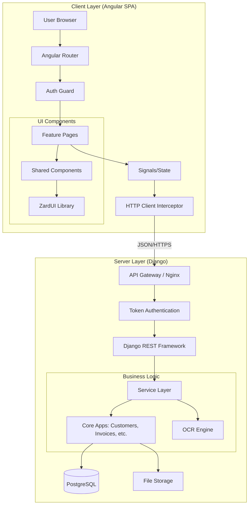

# Technical Design Specification: RevisBaliCRM Decoupling

| Metadata    | Details                                              |
| :---------- | :--------------------------------------------------- |
| **Project** | RevisBaliCRM Frontend Migration                      |
| **Version** | 2.1.0                                                |
| **Status**  | Draft                                                |
| **Date**    | January 24, 2026                                     |
| **Scope**   | Backend API Refactoring & Angular SPA Implementation |

## 1. Executive Summary

This document outlines the architectural design for migrating RevisBaliCRM from a server-side rendered Django application (using Templates and Django Unicorn) to a decoupled architecture. The new system will consist of a robust Django REST Framework (DRF) backend and a modern Angular 19+ Single Page Application (SPA) utilizing the ZardUI component library.

The primary objective is to modernize the user interface, improve interactivity for complex workflows (OCR, document management), and establish a clear separation of concerns, while strictly preserving existing business logic and data integrity.

## 2. Problem Statement

The current monolithic architecture couples the presentation layer tightly with the backend logic. This has led to:

1. **Limited Interactivity:** Complex flows like multi-step document uploads and OCR validation are difficult to implement smoothly with server-side templates.
2. **Maintenance Overhead:** Frontend logic is scattered across Django templates, jQuery scripts, and Unicorn components.
3. **Scalability Constraints:** The API is underutilized, making it difficult to integrate third-party services or mobile apps in the future.

## 3. Goals and Non-Goals

### 3.1 Goals

- **Decoupling:** Establish a strict API boundary between the UI and the data/logic layer.
- **Modern UX:** Implement a responsive, accessible UI using Angular 19 and ZardUI (Tailwind CSS v4).
- **Feature Parity:** Replicate 100% of the existing functionality (Customers, Products, Applications, Invoices, Payments, OCR).
- **Documentation Driven Development:** Maintain live documentation for shared components and implementation feedback throughout the build process.

### 3.2 Non-Goals

- **Database Refactoring:** The database schema will remain unchanged to ensure data continuity.
- **Logic Rewrite:** Business rules (e.g., invoice calculations, workflow transitions) will remain in Python/Django, exposed via API, not rewritten in JavaScript.

## 4. System Architecture

### 4.1 High-Level Diagram



### 4.2 Technology Stack

| Layer          | Technology   | Version | Justification                                                 |
| :------------- | :----------- | :------ | :------------------------------------------------------------ |
| **Frontend**   | Angular      | 19+     | Robust typing, signals for state, standalone components.      |
| **UI Library** | ZardUI       | Latest  | Shadcn-like architecture, Tailwind v4, accessible primitives. |
| **Build Tool** | Bun          | Latest  | Fast package installation and execution.                      |
| **Backend**    | Django       | 4.x/5.x | Existing stable backend.                                      |
| **API**        | DRF          | Latest  | Standard for Django APIs.                                     |
| **Styling**    | Tailwind CSS | v4      | Utility-first, integrated with ZardUI.                        |

## 5. Detailed Component Design

### 5.1 Backend API Layer

The backend will transition from a "View" provider to a "Data" provider.

- **Authentication:** Token-based auth (`/api/api-token-auth/`). Session auth retained for Django Admin panel at `/django-admin/` only.
- **Endpoints:**
  - `ModelViewSets` for standard CRUD (Customers, Products, Invoices).
  - `APIView` for specific actions (OCR trigger, Document Generation).
- **Versioning:** All new/refactored endpoints will be namespaced (e.g., `/api/v1/`) if breaking changes are required, though the goal is to extend the existing `/api/` structure.
- **CORS:** Whitelist configured for the Angular development and production domains.

#### 5.1.1 Authentication Flow Example

```python
# api/views/auth.py
from rest_framework.authtoken.views import ObtainAuthToken
from rest_framework.authtoken.models import Token
from rest_framework.response import Response

class CustomAuthToken(ObtainAuthToken):
    """
    Custom authentication endpoint that returns user details with token.

    POST /api/token/
    Request: { "username": "user@example.com", "password": "pass123" }
    Response: {
        "token": "abc123...",
        "user": { "id": 1, "email": "user@example.com", "firstName": "John" }
    }
    """
    def post(self, request, *args, **kwargs):
        serializer = self.serializer_class(data=request.data,
                                           context={'request': request})
        serializer.is_valid(raise_exception=True)
        user = serializer.validated_data['user']
        token, created = Token.objects.get_or_create(user=user)
        return Response({
            'token': token.key,
            'user': {
                'id': user.id,
                'email': user.email,
                'firstName': user.first_name,
                'lastName': user.last_name,
            }
        })
```

#### 5.1.2 Standardized Error Response Example

```python
# api/utils/exception_handler.py
from rest_framework.views import exception_handler
from rest_framework.exceptions import ValidationError
from rest_framework.response import Response

def custom_exception_handler(exc, context):
    """
    Custom exception handler that formats all errors consistently.

    Example output:
    {
        "code": "validation_error",
        "errors": {
            "email": ["This field must be unique."],
            "phoneNumber": ["Invalid phone number format."]
        }
    }
    """
    response = exception_handler(exc, context)

    if response is not None:
        custom_response = {
            'code': exc.default_code if hasattr(exc, 'default_code') else 'error',
            'errors': response.data
        }
        response.data = custom_response

    return response
```

### 5.2 Frontend Application Structure

The Angular application will follow a modular, domain-driven design.

```text
frontend/
├── src/
│   ├── app/
│   │   ├── core/                 # Singleton services (Auth, API, Guards)
│   │   │   ├── api/              # Generated OpenAPI clients
│   │   │   ├── guards/
│   │   │   │   └── auth.guard.ts
│   │   │   ├── interceptors/
│   │   │   │   └── auth.interceptor.ts
│   │   │   └── services/
│   │   │       └── auth.service.ts
│   │   ├── shared/               # Reusable components & pipes
│   │   │   ├── components/       # ZardUI & Custom UI components
│   │   │   │   ├── data-table/
│   │   │   │   ├── confirm-dialog/
│   │   │   │   └── file-upload/
│   │   │   ├── layouts/          # MainLayout, AuthLayout
│   │   │   └── utils/            # Helper functions
│   │   │       ├── form-errors.ts
│   │   │       └── error-handler.ts
│   │   ├── features/             # Lazy-loaded feature modules
│   │   │   ├── auth/
│   │   │   │   └── login/
│   │   │   ├── customers/
│   │   │   │   ├── customer-list/
│   │   │   │   └── customer-form/
│   │   │   ├── applications/
│   │   │   └── ...
│   │   └── app.routes.ts
│   ├── styles.css                # Tailwind v4 & ZardUI tokens
│   └── environment.ts
├── components.json               # ZardUI config
├── proxy.conf.json               # Dev proxy config
└── bun.lockb
```

### 5.3 File Naming Conventions

**Frontend (TypeScript/Angular):**

- Components: `customer-list.component.ts` (kebab-case)
- Services: `auth.service.ts` (kebab-case)
- Interfaces: `customer.interface.ts` (kebab-case)
- Guards: `auth.guard.ts` (kebab-case)
- Utilities: `form-errors.ts` (kebab-case)

**Backend (Python/Django):**

- Models: `customer.py` (snake_case)
- Serializers: `customer_serializer.py` (snake_case with \_serializer suffix)
- ViewSets: `customer_viewset.py` (snake_case with \_viewset suffix)
- Services: `customer_service.py` (snake_case with \_service suffix)

### 5.4 Shared Component Strategy

To prevent code duplication and ensure UI consistency, a strict component reuse strategy is enforced.

- **Registry File:** A file named `docs/shared_components.md` must be maintained.
- **Content:** Every time a reusable component (e.g., `DataTable`, `ConfirmDialog`, `FileUpload`) is created, it must be documented there with:
  - Component Name & Selector.
  - Input/Output Interface.
  - ZardUI dependencies.
  - Example usage snippet.
- **Rule:** Developers must check this registry before building new UI elements.

### 5.5 Implementation Feedback Loop

To facilitate continuous improvement during the migration.

- **Log File:** A file named `docs/implementation_feedback.md` must be maintained.
- **Content:**
  - **Progress Log:** What features were just completed.
  - **Reuse Hints:** "I created a generic `StatusBadge` in the Customer module that should be moved to Shared for the Invoice module."
  - **Refactor Requests:** "The `CustomerForm` is too large; consider breaking the address section into a sub-component."
- **Workflow:** This file is updated at the end of every major task completion.

## 6. Data Flow & State Management

### 6.1 Authentication Flow

1. User submits credentials via Angular Login Form.
2. `AuthService` POSTs to Django.
3. On 200 OK, Token is stored in `localStorage` (or secure cookie).
4. `TokenInterceptor` injects `Authorization: Token <key>` into all subsequent HTTP calls.
5. `AuthGuard` protects routes; redirects to Login on 401.

#### 6.1.1 AuthService Implementation Pattern

```typescript
// src/app/core/services/auth.service.ts
import { Injectable, signal } from "@angular/core";
import { Router } from "@angular/router";
import { HttpClient } from "@angular/common/http";

export interface User {
  id: number;
  email: string;
  firstName: string;
  lastName: string;
}

export interface LoginRequest {
  username: string;
  password: string;
}

export interface AuthResponse {
  token: string;
  user: User;
}

@Injectable({ providedIn: "root" })
export class AuthService {
  private userSignal = signal<User | null>(null);
  readonly user = this.userSignal.asReadonly();

  constructor(
    private http: HttpClient,
    private router: Router,
  ) {
    this.loadUserFromStorage();
  }

  async login(credentials: LoginRequest): Promise<void> {
    const response = await this.http
      .post<AuthResponse>("/api/token/", credentials)
      .toPromise();

    if (response) {
      localStorage.setItem("access_token", response.token);
      localStorage.setItem("user", JSON.stringify(response.user));
      this.userSignal.set(response.user);
    }
  }

  logout(): void {
    localStorage.removeItem("access_token");
    localStorage.removeItem("user");
    this.userSignal.set(null);
    this.router.navigate(["/login"]);
  }

  isAuthenticated(): boolean {
    return !!localStorage.getItem("access_token");
  }

  private loadUserFromStorage(): void {
    const userJson = localStorage.getItem("user");
    if (userJson) {
      this.userSignal.set(JSON.parse(userJson));
    }
  }
}
```

#### 6.1.2 Auth Interceptor Pattern

```typescript
// src/app/core/interceptors/auth.interceptor.ts
import { HttpInterceptorFn } from "@angular/common/http";

export const authInterceptor: HttpInterceptorFn = (req, next) => {
  const token = localStorage.getItem("access_token");

  if (token && !req.url.includes("/api/token/")) {
    req = req.clone({
      setHeaders: {
        Authorization: `Token ${token}`,
      },
    });
  }

  return next(req);
};
```

### 6.2 State Management Patterns

#### 6.2.1 Local Component State (Simple)

```typescript
// For isolated component data
export class CustomerListComponent {
  customers = signal<Customer[]>([]);
  isLoading = signal(false);
  pagination = signal({ page: 1, pageSize: 10, total: 0 });

  async loadCustomers() {
    this.isLoading.set(true);
    try {
      const response = await this.customerApi.getCustomers({
        page: this.pagination().page,
        pageSize: this.pagination().pageSize,
      });
      this.customers.set(response.results);
      this.pagination.update((p) => ({ ...p, total: response.count }));
    } finally {
      this.isLoading.set(false);
    }
  }
}
```

#### 6.2.2 Computed Values

```typescript
// For derived state
export class InvoiceFormComponent {
  lineItems = signal<LineItem[]>([]);
  taxRate = signal(0.1); // 10%

  subtotal = computed(() =>
    this.lineItems().reduce((sum, item) => sum + item.total, 0),
  );

  tax = computed(() => this.subtotal() * this.taxRate());
  total = computed(() => this.subtotal() + this.tax());
}
```

#### 6.2.3 Service-Level State (Shared)

```typescript
// For cross-component data
@Injectable({ providedIn: "root" })
export class CustomerStateService {
  private customersSignal = signal<Customer[]>([]);
  readonly customers = this.customersSignal.asReadonly();

  constructor(private customerApi: CustomerApiService) {}

  async loadCustomers() {
    const data = await this.customerApi.getCustomers();
    this.customersSignal.set(data.results);
  }

  async createCustomer(data: CreateCustomerDto) {
    const customer = await this.customerApi.createCustomer(data);
    this.customersSignal.update((list) => [...list, customer]);
    return customer;
  }
}
```

### 6.3 Document OCR Flow

1. User uploads file via `FileUploadComponent`.
2. Angular POSTs `FormData` to `/api/documents/`.
3. Backend saves file, triggers async OCR task, returns `job_id`.
4. Angular polls `/api/ocr/status/<job_id>` every 2 seconds.
5. On "Complete", Angular fetches extracted data and populates the verification form.

#### 6.3.1 OCR Polling Pattern

```typescript
// src/app/features/applications/services/ocr.service.ts
import { Injectable } from '@angular/core';
import { HttpClient } from '@angular/common/http';
import { timer, switchMap, takeWhile, tap } from 'rxjs';

export interface OcrStatus {
  status: 'processing' | 'complete' | 'failed';
  progress: number;
  data?: any;
  error?: string;
}

@Injectable({ providedIn: 'root' })
export class OcrService {
  constructor(private http: HttpClient) {}

  pollOcrStatus(jobId: string) {
    return timer(0, 2000).pipe(
      switchMap(() => this.http.get<OcrStatus>(`/api/ocr/status/${jobId}/`)),
      tap(status => console.log('OCR Progress:', status.progress)),
      takeWhile(status => status.status === 'processing', true)
    );
  }
}

// Usage in component
async uploadDocument(file: File) {
  const formData = new FormData();
  formData.append('file', file);

  const response = await this.http.post<{ jobId: string }>(
    '/api/documents/',
    formData
  ).toPromise();

  this.ocrService.pollOcrStatus(response!.jobId).subscribe({
    next: (status) => {
      this.ocrProgress.set(status.progress);
      if (status.status === 'complete') {
        this.populateFormWithOcrData(status.data);
      }
    },
    error: (err) => this.toast.error('OCR failed')
  });
}
```

### 6.4 Real-Time Updates (SSE + Fallback)

The legacy system uses Server-Sent Events (SSE) for long-running workflows. The Angular SPA **MUST** provide a native SSE abstraction and fallback to polling when SSE is unavailable or too costly.

**Guidelines:**

- Prefer SSE (`EventSource`) for streaming progress updates.
- Use polling with exponential backoff as a fallback.
- Keep payloads minimal (progress, status, message).
- Close streams on component destroy to prevent leaks.
- For auth: use session cookies where possible; if token auth is required, pass short-lived tokens via query params.

**Reference Pattern:**

```typescript
// src/app/core/services/sse.service.ts
import { Injectable, NgZone } from "@angular/core";
import { Observable } from "rxjs";

@Injectable({ providedIn: "root" })
export class SseService {
  constructor(private zone: NgZone) {}

  connect<T>(url: string, withCredentials = true): Observable<T> {
    return new Observable<T>((subscriber) => {
      const source = new EventSource(url, { withCredentials });

      source.onmessage = (event) => {
        this.zone.run(() => subscriber.next(JSON.parse(event.data) as T));
      };

      source.onerror = (err) => {
        this.zone.run(() => subscriber.error(err));
        source.close();
      };

      return () => source.close();
    });
  }
}
```

## 7. Anti-Patterns to Avoid

### 7.1 DON'T: Manual HTTP calls in components

```typescript
// ❌ BAD
export class CustomerListComponent {
  async loadCustomers() {
    const response = await fetch("/api/customers/");
    this.customers = await response.json();
  }
}
```

```typescript
// ✅ GOOD
export class CustomerListComponent {
  constructor(private customerApi: CustomerApiService) {}

  async loadCustomers() {
    const data = await this.customerApi.getCustomers();
    this.customers.set(data.results);
  }
}
```

### 7.2 DON'T: Business logic in components

```typescript
// ❌ BAD - Complex calculations in frontend
calculateInvoiceTotal(lineItems: LineItem[]): number {
  return lineItems.reduce((sum, item) => {
    const itemTotal = item.quantity * item.price;
    const discount = item.discount || 0;
    const tax = itemTotal * 0.1;
    return sum + (itemTotal - discount + tax);
  }, 0);
}
```

```typescript
// ✅ GOOD - Let backend handle complex calculations
async calculateInvoiceTotal(invoiceId: number) {
  const invoice = await this.invoiceApi.calculateTotals(invoiceId);
  this.total.set(invoice.total);
}
```

### 7.3 DON'T: Use NgModules for features

```typescript
// ❌ BAD - Old NgModule pattern
@NgModule({
  declarations: [CustomerListComponent, CustomerFormComponent],
  imports: [CommonModule, ReactiveFormsModule],
})
export class CustomersModule {}
```

```typescript
// ✅ GOOD - Standalone components
@Component({
  selector: "app-customer-list",
  standalone: true,
  imports: [CommonModule, DataTableComponent],
  templateUrl: "./customer-list.component.html",
})
export class CustomerListComponent {}
```

### 7.4 DON'T: Store state in BehaviorSubject

```typescript
// ❌ BAD - Old RxJS pattern
export class CustomerService {
  private customersSubject = new BehaviorSubject<Customer[]>([]);
  customers$ = this.customersSubject.asObservable();
}
```

```typescript
// ✅ GOOD - Use signals
export class CustomerService {
  private customersSignal = signal<Customer[]>([]);
  customers = this.customersSignal.asReadonly();
}
```

## 8. Migration Strategy

1. **Preparation:** Audit API, setup Angular+Bun+ZardUI.
2. **Foundation:** Build Core (Auth, API Service) and Shared (Layout, Tables).
3. **Vertical Slices:** Migrate one module at a time (e.g., Customers -> Products -> Applications).
4. **Parallel Run:** Angular app deployed alongside Django. Nginx routes `/app/` to Angular and `/` to Django (legacy).
5. **Cutover:** Redirect root `/` to Angular once parity is confirmed.

## 9. Open Questions & Risks

- **Risk:** Complex Django Template logic (e.g., conditional rendering based on user permissions) might be missed during API conversion.
  - _Mitigation:_ Detailed audit of `views.py` vs `serializers.py` (Task 1.2).
- **Risk:** File serving permissions for private documents.
  - _Mitigation:_ Ensure DRF endpoints for file download enforce `IsAuthenticated`.
