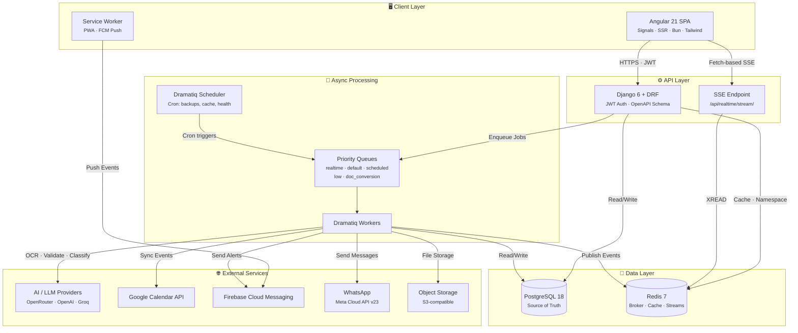
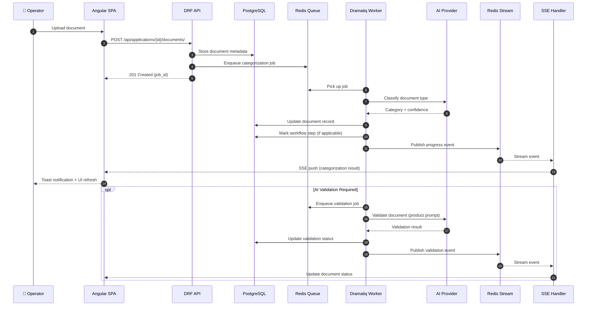
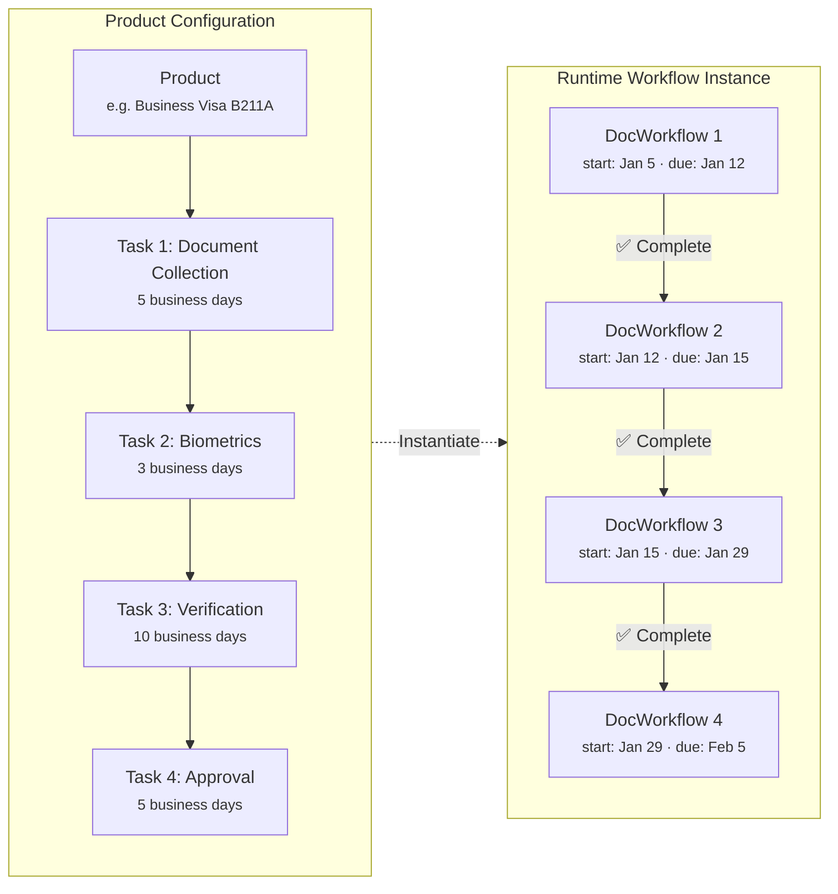
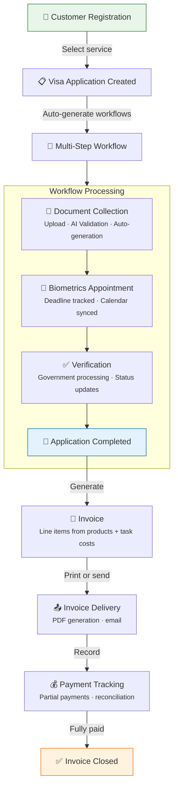
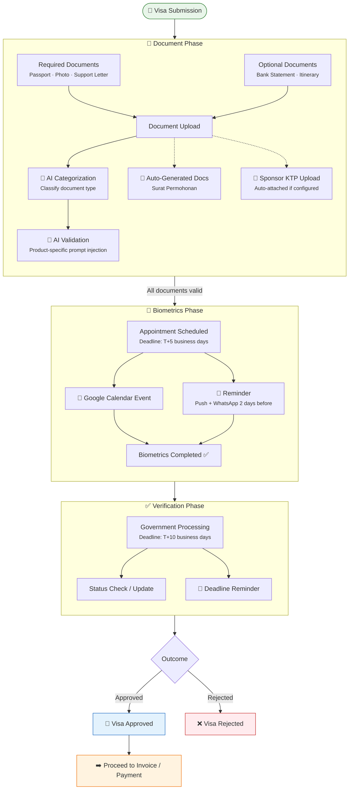
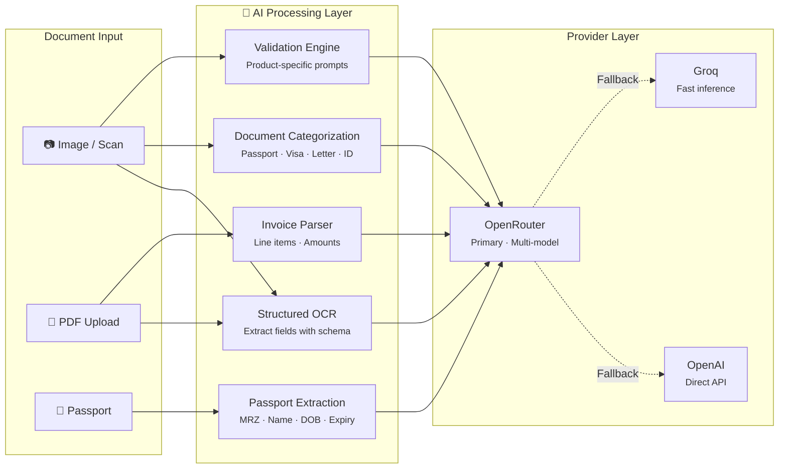
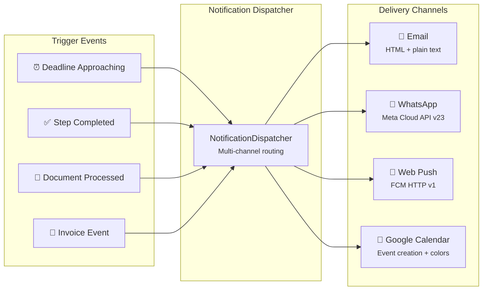
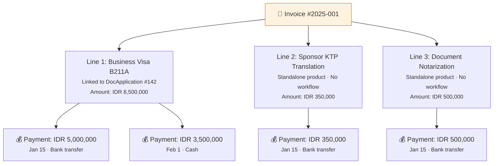
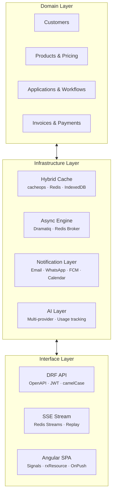
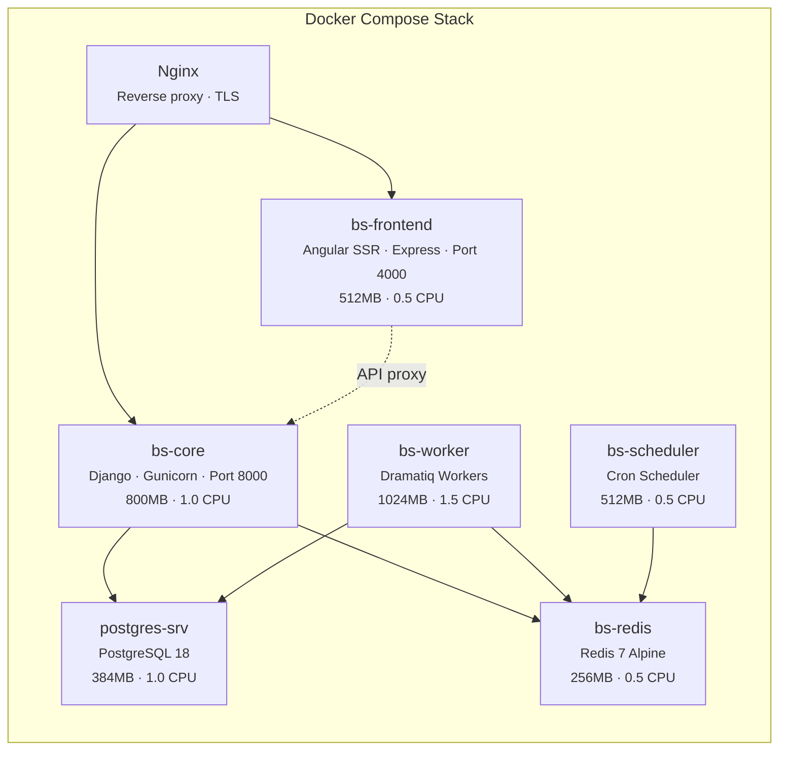

# BusinessSuite — Full-Stack Business Operations Platform

**A production-grade ERP/CRM system for visa agency operations, built to demonstrate end-to-end software engineering across architecture, fullstack development, AI integration, and DevOps.**

> 📖 **[← Back to README.md](README.md)**

---

## System at a Glance

| Dimension         | Detail                                                             |
| ----------------- | ------------------------------------------------------------------ |
| **Domain**        | Visa & document-service agency operations                          |
| **Backend**       | Django 6 · Django REST Framework 3.16 · PostgreSQL 18              |
| **Frontend**      | Angular 21 · Signals · SSR · Bun · Tailwind CSS                    |
| **Async Engine**  | Dramatiq 2.x · Redis 7 · 5 priority queues                         |
| **AI / LLM**      | OpenRouter · OpenAI · Groq — runtime-switchable                    |
| **Realtime**      | Server-Sent Events over Redis Streams                              |
| **Notifications** | Google Calendar · FCM Web Push · WhatsApp (Meta Cloud API) · Email |
| **API Contract**  | OpenAPI 3 schema → auto-generated TypeScript client                |
| **Testing**       | pytest · Vitest · Playwright E2E                                   |
| **Deployment**    | Docker Compose · Gunicorn · SSR Express · Nginx · Grafana/Loki     |

---

## Table of Contents

1. [Executive Summary](#executive-summary)
2. [Why This System Exists](#why-this-system-exists)
3. [Key Capabilities](#key-capabilities)
4. [High-Level Architecture](#high-level-architecture)
5. [Component Interaction Overview](#component-interaction-overview)
6. [Workflow Engine](#workflow-engine)
7. [Business Flow: Customer to Invoice](#business-flow-customer-to-invoice)
8. [Business Flow: Visa Application Lifecycle](#business-flow-visa-application-lifecycle)
9. [AI-Assisted Automation](#ai-assisted-automation)
10. [Notifications & Calendar Integration](#notifications--calendar-integration)
11. [Invoice & Document Generation](#invoice--document-generation)
12. [Extensibility & Customization](#extensibility--customization)
13. [DevOps, Deployment & Reliability](#devops-deployment--reliability)
14. [Why This Project Is Portfolio-Worthy](#why-this-project-is-portfolio-worthy)
15. [Future Improvements](#future-improvements)

---

## Executive Summary

BusinessSuite is a custom-built business operations platform designed for a visa agency in Bali. It replaces fragmented spreadsheets, manual reminders, and paper-based workflows with a single system that manages the full lifecycle: customer onboarding, multi-step application processing, document collection with AI validation, automatic deadline tracking, invoice generation, and multi-channel notifications.

The architecture separates concerns cleanly: a Django/DRF API handles business logic and data integrity, an Angular SPA delivers a responsive operator interface with Server-Side Rendering, Dramatiq workers process long-running jobs asynchronously, and Redis serves as both the message broker and the caching layer. AI capabilities (document OCR, validation, classification) are integrated through a provider-agnostic client that supports OpenRouter, OpenAI, and Groq — switchable at runtime without redeployment.

The system was designed with intentional architectural depth: not because a visa agency demands enterprise infrastructure, but to demonstrate that I can design, build, and operate scalable full-stack applications end to end.

---

## Why This System Exists

Visa and document-service workflows are high-variance and deadline-driven. Documents arrive late, government timelines shift, and external APIs fail. A system that handles this needs to be:

- **Resilient** — background jobs with retries, idempotency locks, and progress tracking
- **Observable** — structured logging, audit trails, and real-time job status
- **Flexible** — workflows that adapt to different visa types and service products
- **Integrated** — calendar sync, push notifications, and WhatsApp alerts keep the team informed without checking a dashboard

This is a real system solving real problems for a real business. Every feature exists because an operator needed it.

---

## Key Capabilities

| Capability               | Implementation                                                                                           |
| ------------------------ | -------------------------------------------------------------------------------------------------------- |
| **Customer Management**  | Central database with search, audit trail, document history                                              |
| **Product Catalog**      | Configurable products with pricing, validity periods, required documents, and AI validation prompts      |
| **Workflow Engine**      | Multi-step processes with automatic deadline calculation, calendar sync, and step-by-step progression    |
| **Document Processing**  | Upload, AI-powered OCR extraction, automatic categorization, and rule-based validation                   |
| **Invoice Generation**   | Supports both workflow-linked services and standalone products; async PDF generation                     |
| **Payment Tracking**     | Reconciliation against invoice line items; partial payment support                                       |
| **AI Integration**       | Runtime-configurable LLM providers for OCR, document validation, categorization, and passport extraction |
| **Realtime Updates**     | Redis Streams → SSE push to frontend with cursor-based replay on reconnect                               |
| **Multi-Channel Alerts** | Email, WhatsApp (Meta Cloud API), FCM Web Push, Google Calendar events                                   |
| **Reporting**            | Pipeline KPIs, finance summaries, and exportable reports                                                 |
| **Feature Controls**     | Runtime settings and environment overrides for rollout and safe operational toggles                      |
| **Hybrid Caching**       | Per-user cache namespaces (cacheops) + IndexedDB browser cache with version-aware invalidation           |

---

## High-Level Architecture



---

## Component Interaction Overview

The following sequence diagram shows how a typical document upload flows through the system — from user action through storage, AI processing, workflow advancement, and real-time notification.



---

## Workflow Engine

Every product in the system can define a multi-step workflow. Each step (called a **Task**) has a name, duration, cost, and notification rules. When a customer application is created for a product, the system generates a `DocWorkflow` record for each task — with calculated start dates, due dates, and calendar integration.

### Workflow Design



### Key Properties

- **Automatic Progression**: completing a step advances the workflow to the next
- **Deadline Awareness**: each step calculates due dates using business-day or calendar-day durations
- **Calendar Sync**: tasks with `add_task_to_calendar = true` create Google Calendar events automatically
- **Customer Notifications**: configurable per-step — email, WhatsApp, or push notification N days before deadline
- **Terminal States**: a workflow reaches completion when all steps are marked `COMPLETED`, or stops on `REJECTED`
- **Full Customization**: add, remove, or reorder steps per product — the system adapts

---

## Business Flow: Customer to Invoice

This is the core business cycle that the system automates end to end.



> **Invoices are flexible.** They can contain line items linked to active visa applications (with cost breakdowns from workflow steps) as well as standalone products that have no workflow — like document translation or notarization services.

---

## Business Flow: Visa Application Lifecycle

A detailed look at what happens inside the workflow engine for a typical visa application.



### What Makes This Workflow Powerful

| Feature                           | How It Works                                                                                                                                                    |
| --------------------------------- | --------------------------------------------------------------------------------------------------------------------------------------------------------------- |
| **Per-product configuration**     | Each visa type defines its own steps, durations, required documents, and notification rules                                                                     |
| **AI document validation**        | Products embed validation prompts — when a document is uploaded, the prompt is injected into the AI validator to check completeness, legibility, and compliance |
| **Automatic document generation** | Standard documents like _Surat Permohonan_ are generated from templates using customer and application data                                                     |
| **Deadline calculation**          | Due dates are computed from step durations (business days or calendar days) relative to the previous step's completion                                          |
| **Multi-channel alerts**          | Calendar events, push notifications, email, and WhatsApp — configurable per workflow step                                                                       |
| **Auditability**                  | Every status change, document upload, and workflow transition is logged with timestamp and user attribution                                                     |

---

## AI-Assisted Automation

AI capabilities are production-integrated — they solve real operational problems rather than being bolted on for novelty.

### AI Features in Production



### Runtime Configuration

The AI layer is designed for operational flexibility:

- **Provider switching at runtime** — change between OpenRouter, OpenAI, and Groq without redeployment
- **Model selection per feature** — OCR can use a vision model while categorization uses a cheaper text model
- **Persisted customizations** — once a team member changes a provider or model for a feature, the system remembers
- **Usage tracking** — input/output tokens, cached tokens, and estimated cost are tracked per AI feature
- **Health monitoring** — cron job checks OpenRouter credit balance every 5 minutes
- **Fallback chain** — retriable error codes trigger automatic fallback to alternate providers

### Validation Prompt Injection

Each product can define a `validation_prompt` — a natural-language instruction set that tells the AI what to check when validating an uploaded document for that product.

> _Example:_ A B211A business visa product might include: _"Verify that the support letter is addressed to the immigration office, contains the sponsor's company details, and includes a stamp or digital signature."_

This prompt is injected into the validation pipeline when a document is uploaded for an application of that product type — making validation rules configurable without code changes.

---

## Notifications & Calendar Integration

The system keeps operators and customers informed through four channels, configurable per workflow step.



| Channel             | Integration                    | Notes                                                                                  |
| ------------------- | ------------------------------ | -------------------------------------------------------------------------------------- |
| **Email**           | Django EmailMultiAlternatives  | HTML + plain-text body; configurable sender                                            |
| **WhatsApp**        | Meta Cloud API v23             | Template messages for delivery guarantee; free-form fallback; auto-retry on API limits |
| **Web Push**        | Firebase Cloud Messaging (FCM) | Service worker registration; device token management; test endpoint for debugging      |
| **Google Calendar** | Google Calendar API            | Events created per workflow step; color-coded by priority; synced via Dramatiq actor   |

---

## Invoice & Document Generation

### Invoice Structure

Invoices are intentionally flexible. A single invoice can combine:

- **Workflow-linked services**: visa applications where each task step carries a cost that rolls up to the invoice line item
- **Standalone products**: services like document translation or notarization that don't have a workflow



### Document Generation

The system generates business documents from DOCX templates using mail merge:

- **Surat Permohonan** — standard immigration request letter, auto-filled with customer and application data
- **Invoices** — async PDF generation via Dramatiq workers; delivered to the browser via SSE progress events
- **Letters** — configurable letter templates for different government offices and requirements
- **Reports** — exportable to Excel (openpyxl) or PDF

---

## Extensibility & Customization

The platform is built for a visa agency, but the underlying architecture is domain-agnostic.

### What Can Be Customized Without Code Changes

| Element                   | Mechanism                                                                                             |
| ------------------------- | ----------------------------------------------------------------------------------------------------- |
| **Workflows**             | Products define their own task steps — add, remove, or reorder at any time                            |
| **AI models**             | Switch LLM provider and model per feature at runtime; choices are persisted                           |
| **Validation rules**      | Per-product validation prompts control what the AI checks on document upload                          |
| **Notification channels** | Each workflow step configures whether to send calendar events, push notifications, or customer alerts |
| **Document templates**    | DOCX templates with merge fields — update the template, change the output                             |
| **Feature controls**      | Runtime settings control rollout without deployment                                                   |
| **Pricing**               | Product prices tracked with history; invoice amounts can be overridden per line item                  |
| **Queues & concurrency**  | Dramatiq queue assignment and worker thread counts are environment-configurable                       |

### Architectural Separation

The system maintains clear boundaries between concerns:



Each layer can evolve independently. The workflow engine doesn't know about the frontend. The AI layer doesn't know about invoices. External integrations are isolated behind service boundaries.

---

## DevOps, Deployment & Reliability

### Production Topology



### Reliability Features

| Concern                   | Solution                                                                                                |
| ------------------------- | ------------------------------------------------------------------------------------------------------- |
| **Health checks**         | HTTP probes on API (`/api/health/`) and frontend (`/healthz`); custom scripts for workers and scheduler |
| **Resource limits**       | Per-container CPU and memory caps prevent runaway processes                                             |
| **Job resilience**        | Dramatiq actors use configurable retries, time limits, and idempotency locks                            |
| **Scheduled maintenance** | Automated cron: full backup at 02:00, cache clear at 03:00, audit log pruning at 04:00                  |
| **Structured logging**    | JSON-formatted logs to mounted volumes; ready for Grafana/Loki collection                               |
| **Audit trail**           | django-auditlog records model-level changes with user attribution                                       |
| **Graceful degradation**  | Frontend initialization has 15s global timeout; renders fallback UI if backend is unreachable           |
| **Cache invalidation**    | Per-user namespace versioning; cacheops handles ORM-level invalidation automatically                    |
| **Database tuning**       | TCP keepalives, idle transaction timeouts, connection pooling via Gunicorn                              |

### Scheduled Jobs

| Time     | Job                              | Queue     |
| -------- | -------------------------------- | --------- |
| 02:00    | Full database backup             | scheduled |
| 03:00    | Cache namespace clear            | scheduled |
| 04:00    | Audit log pruning                | scheduled |
| \*/5 min | OpenRouter health & credit check | default   |

---

## Why This Project Is Portfolio-Worthy

This is not a tutorial project with a to-do list and a login page. It is a working system, deployed for real business operations, built with intentional architectural depth.

### What It Demonstrates

| Skill                     | Evidence                                                                                                                                              |
| ------------------------- | ----------------------------------------------------------------------------------------------------------------------------------------------------- |
| **Software Architecture** | Clear separation between domain, infrastructure, and interface layers; service-oriented backend with 25+ async task types across 5 priority queues    |
| **Backend Engineering**   | Django 6 / DRF with custom viewsets, service layer, query optimization (select_related/prefetch_related), and canonical error handling                |
| **Frontend Engineering**  | Angular 21 with signals, standalone components, OnPush change detection, SSR, base component inheritance, and a generated API client                  |
| **API Design**            | Contract-first development: OpenAPI schema generated from DRF, then used to generate the TypeScript client — no manual DTO management                 |
| **AI Integration**        | Production-grade AI pipeline with provider abstraction, runtime switching, usage tracking, structured output schemas, and validation prompt injection |
| **Async Processing**      | Dramatiq actors with Redis broker, priority queues, idempotency, retries, progress tracking, and SSE-based real-time feedback                         |
| **DevOps**                | Docker Compose orchestration with health checks, resource limits, structured logging, automated backups, and Grafana-ready observability              |
| **Security**              | JWT with HttpOnly refresh cookie, permission-based access control (group helpers), throttling, and CORS configuration                                 |
| **Testing**               | Backend: pytest with mocked IO and property-based testing (Hypothesis). Frontend: Vitest unit tests + Playwright E2E                                  |
| **Product Thinking**      | Every feature maps to a real operational need — deadline management, document compliance, payment reconciliation, customer communication              |

### The Technology Stack

```
Frontend:   Angular 21 · TypeScript 5.9 · Tailwind CSS 4 · Bun · SSR · PWA
Backend:    Django 6 · DRF 3.16 · PostgreSQL 18 · Redis 7
Async:      Dramatiq 2 · Redis Streams · SSE
AI:         OpenRouter · OpenAI · Groq · PassportEye · OpenCV
Messaging:  FCM · WhatsApp Meta API · Google Calendar · Email
DevOps:     Docker Compose · Gunicorn · Nginx · Grafana/Loki
Testing:    pytest · Hypothesis · Vitest · Playwright
Tooling:    OpenAPI Generator · drf-spectacular · django-auditlog
```

---

## Future Improvements

These are planned enhancements that build on the existing architecture:

- **Multi-tenant support** — isolate data and configurations per agency while sharing infrastructure
- **Offline-first mobile client** — leverage the existing local resilience sync service for field agents
- **Advanced analytics dashboard** — pipeline conversion rates, processing time distributions, revenue forecasting
- **Webhook-driven integrations** — expose configurable webhooks for external system integration
- **Expanded AI capabilities** — automated follow-up drafting, intelligent deadline prediction based on historical processing times

---

<p align="center">
  <sub>Built with purpose. Engineered with depth. Deployed for real operations.</sub>
</p>
