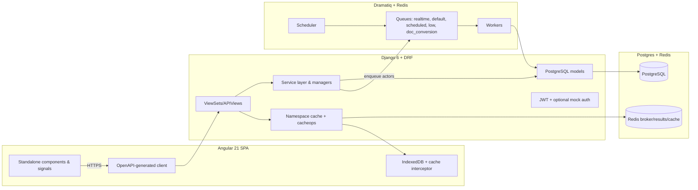

# BusinessSuite (RevisBali CRM/ERP)


**ERP/CRM for visa and document-service agencies**: customer onboarding, application workflows, document collection + OCR, invoices, payments, and deadline calendars.

Quick links: [Architecture](docs/architecture.md) · [Backend](docs/backend.md) · [Frontend](docs/frontend.md) · [Async Processing](docs/async-processing.md) · [Deployment](docs/deployment.md)

---

## Hero Description
BusinessSuite is built for agencies that process visa/stay-permit applications and need an auditable, deadline-driven workflow with async automation (OCR, document validation, calendar sync, invoice jobs).

---

## Screenshots or Architecture Diagram Placeholders 🖼️
| What | Placeholder | Notes |
| --- | --- | --- |
| Dashboard | Add: `docs/assets/screenshot-dashboard.png` | KPIs, pipeline, finance widgets |
| Application detail | Add: `docs/assets/screenshot-application.png` | Document checklist, workflow steps, OCR job status |
| Invoices | Add: `docs/assets/screenshot-invoices.png` | Invoice list/detail, async downloads |
| Architecture | See diagram below | System boundaries and queues |

---

## Key Features ✨
- Customer + product catalog with required/optional document sets
- Application workflows with deadlines and Google Calendar sync
- Async OCR and document validation/categorization jobs
- Invoice generation (sync/async) and payment reconciliation
- Reports, admin tools, backups/restore utilities, feature flags (waffle)
- Hybrid caching (cacheops + per-user namespace) with optional browser caching

---

## Why This Project Exists
Visa/document workflows are high-variance and time-sensitive: external APIs fail, documents arrive late, and finance must be traceable. The architecture keeps the request path fast while pushing heavy and failure-prone work into resilient background jobs.

---

## Architecture Overview 🏗️


More detail: `docs/architecture.md`.

---

## Technology Stack 🧰
| Layer | Technology | Notes |
| --- | --- | --- |
| Backend API | Django 6, DRF, SimpleJWT | camelCase JSON via `djangorestframework-camel-case` |
| Async | Dramatiq 2 + Redis | queues: `realtime`, `default`, `scheduled`, `low`, `doc_conversion` |
| Frontend | Angular 21 + Bun | standalone components, signals, OnPush; SSR in production |
| DB | PostgreSQL 18 | source of truth |
| Cache | django-cacheops + namespace wrapper | per-user isolation + automatic invalidation |
| Observability | logs/ + collectors | Alloy/Promtail + Grafana/Loki (collector-driven) |

---

## How the System Works (high level)
- Angular calls DRF endpoints using a generated OpenAPI client.
- JWT (`Authorization: Bearer ...`) is attached by an interceptor; refresh happens on 401.
- Writes happen in Django services/models; external IO is queued to Dramatiq.
- Workers run task actors with retries + tracing; long jobs persist progress to DB.
- Caching layers: IndexedDB (frontend) → per-user namespace (backend) → cacheops → Postgres.

---

## Example Use Case (visa agency / workflow automation)
1. Create a customer and select a product (visa/stay permit).
2. Open an application and start collecting required documents.
3. Trigger OCR/validation jobs; staff reviews results while work continues in the background.
4. Deadlines are mirrored locally and synced to Google Calendar asynchronously.
5. Generate an invoice (sync or async) and track payments until settled.
6. Use reports to monitor pipeline health and finance KPIs.

---

## Installation 🚀
### Prerequisites
- Python 3.12+ (backend deps are managed via `uv`)
- Bun 1.3+ (frontend)
- Docker (for local Postgres/Redis and optional all-in-one stack)

### Local Quickstart (all-in-one Docker stack)
This runs DB + Redis + backend + workers + scheduler + frontend containers (plus optional Grafana/Loki).

```bash
cp .env.example .env  # if you have one; otherwise create .env
docker compose -f docker-compose-local.yml --profile app up -d
```

If you do not want the local observability stack, start only the app services:
```bash
docker compose -f docker-compose-local.yml --profile app up -d db redis bs-core bs-worker bs-scheduler bs-frontend
```

Default local ports (from `docker-compose-local.yml`):
| Service | URL |
| --- | --- |
| Backend API | http://localhost:8000 |
| Frontend | http://localhost:4200 |
| Grafana (optional) | http://localhost:3000 |
| Loki (optional) | http://localhost:3100 |

### Local Dev (infra in Docker, app on host)
```bash
docker compose -f docker-compose-local.yml up -d db redis
uv sync
cd frontend && bun install
```

At minimum, set these env vars in `.env`:
- `DB_HOST`, `DB_PORT`, `DB_NAME`, `DB_USER`, `DB_PASS`
- `REDIS_URL` (or `REDIS_HOST` + `REDIS_PORT`)
- `SECRET_KEY`, `JWT_SIGNING_KEY`

---

## Forking and Deployment Guide
- Keep API changes contract-first: update serializer/view → regenerate `backend/schema.yaml` → regenerate the Angular client.
- Prefer extending shared UI components in `frontend/src/app/shared/components/` (update `docs/shared_components.md` when adding new ones).
- Use waffle flags for risky changes that need runtime toggles.
- In CI, enforce schema/client drift checks and run backend/frontend tests.

---

## Running on a VPS (step-by-step) 🖥️
### 1) Single-node (recommended starting point)
1. Install Docker + docker compose plugin.
2. Clone repo and create `.env` (DB/Redis/auth secrets + integration keys).
3. Run the stack:
   ```bash
   docker compose -f docker-compose-local.yml --profile app up -d
   ```
4. Put a reverse proxy (Nginx/Caddy) in front of ports 8000/4200, enable TLS, and lock down admin endpoints.

### 2) Production compose (advanced)
`docker-compose.yml` is more production-oriented (OTel wiring, external network/volumes). Review and adapt it to your environment and proxy setup.

More detail: `docs/deployment.md`.

---

## Developer Setup
### Run services
```bash
# Infra
docker compose -f docker-compose-local.yml up -d db redis

# Backend
uv sync
cd backend
uv run python manage.py migrate
uv run python manage.py runserver 0.0.0.0:8000

# Workers (separate terminal)
cd backend && uv run dramatiq business_suite.dramatiq --queues realtime,default,scheduled,low,doc_conversion

# Scheduler (separate terminal)
cd backend && uv run python manage.py run_dramatiq_scheduler

# Frontend (separate terminal)
cd frontend && bun install && bun run start
```

### Regenerate OpenAPI schema and frontend client
Preferred:
```bash
./refresh-schema-and-api.sh
```

Manual:
```bash
cd backend && uv run python manage.py spectacular --file schema.yaml
cd frontend && bun run generate:api
```

---

## Contributing Guide
- Read: `docs/coding-standards.md` and `docs/extension-guide.md`.
- Keep views thin; put business logic in services/managers/models; add tests for new logic.
- Update docs when changing architecture or developer workflows.
- For UI work: reuse shared components and update `docs/shared_components.md`.

---

## Future Roadmap
- Multi-tenant hardening and per-tenant cache namespaces
- More configurable AI validation policies and workflow automation
- Deployment templates for Kubernetes
- Expanded accessibility regression coverage in CI (Playwright + axe)

---

## License
MIT (see `LICENSE`).
